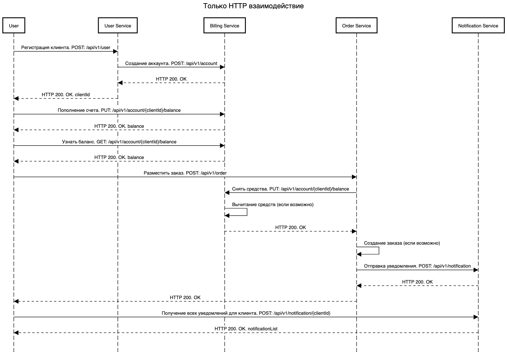
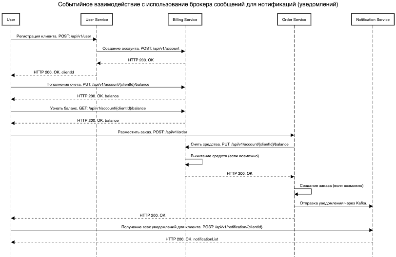
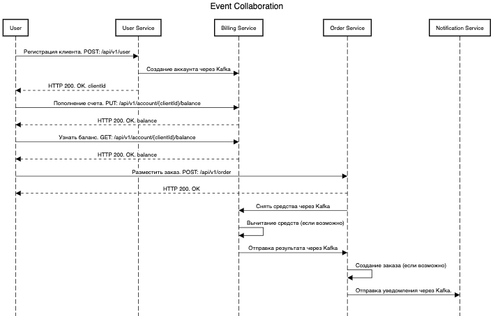
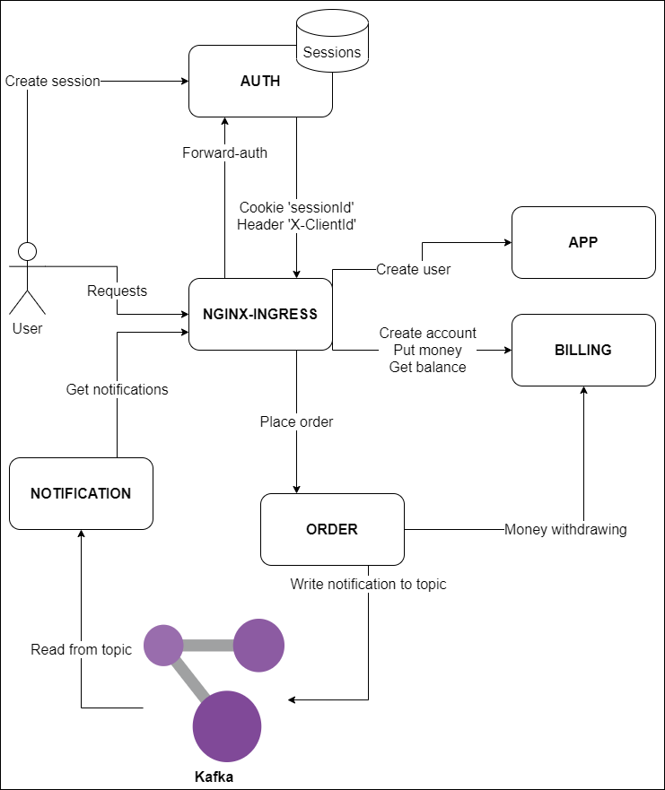

# Homework №7 Sergey Chachanagov

Реализована идемпотентность создания заказа на основе проверки версии.


При размещении заказа проверяется наличие существующих по ID клиента и сумме заказа.
Если такой заказ уже есть и версия нового заказа <= версии существующего,
то возвращается ID существующего заказа. Новый заказ при этом не создается.

## Теоретическая часть.
### Варианты взаимодействий:
1. Только HTTP взаимодействие
   
   
   
2. Событийное взаимодействие с использованием брокера сообщений для уведомлений
   
   
   
3. Event Collaboration
   
   

Вариант, который мне кажется наиболее правильным для решения данной задачи:

№2. Событийное взаимодействие с использованием брокера сообщений для уведомлений


## Практическая часть
Схема приложения:



Выше приведена схема взаимодействия сервисов.
Аутентификация реализована с использованием forward-auth на Ingress-NGINX.
Пользователю предоставляется REST API.
Межсервисное взаимодействие используется комбинированного вида:
ORDER взаимодействует с BILLING по REST, а с NOTIFICATION асинхронно с помощью Kafka.
***
Установка приложений в неймспейс order-app

```
helm install app app-chart/ --namespace order-app --create-namespace
helm install auth auth-chart/ --namespace order-app
helm install billing billing-chart/ --namespace order-app
helm install order order-chart/ --namespace order-app
helm install notification notification-chart/ --namespace order-app
```
***
Коллекция постмана - **"Chachanagov-hm7.postman_collection.json"**

Команда для запуска:
```
newman run Chachanagov-hm7.postman_collection.json
```
